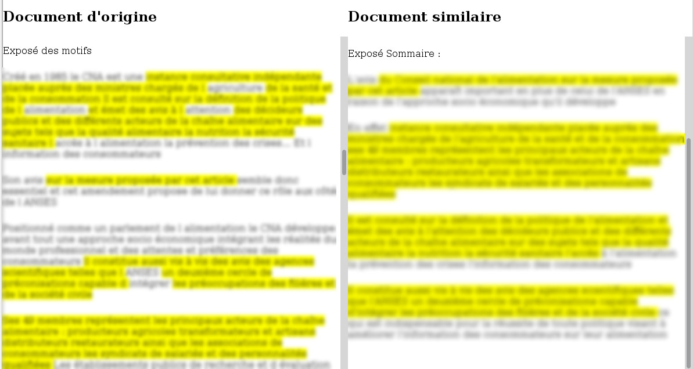

#Lobby Tack

## Retrouver la trace des lobbyes dans le travail des parlementaire

Ces deux scripts permettent de retrouver les copier/coller réalisés par les parlementaires de documents issus de lobbyies.

Pour le faire fonctionner, il faut utiliser une version "texte brute" de documents produits par les lobbyies.

Ce document texte sera affronté aux moteurs de recherche de NosDéputés.fr et/ou NosSénateurs.fr via le script *queryFromTxt.sh*.

Le script *highlightTrack.py* permet de représenter graphiquement les éléments communs dans les documents.

### queryFromTxt.sh

Pour rechercher les documents parlementaments de NosDéputés.fr qui reprennent des parties du fichier texte *document_lobby.txt* :

    bash queryFromTxt.sh document_lobby.txt nosdeputes.fr

Pour trouver les documents sénatoriaux :

    bash queryFromTxt.sh document_lobby.txt nossenateurs.fr

Ces scripts produisent des fichiers triant par pertinence les documents intéressant (plus pertinent en premier) :

Pour NosDéputés.fr (avec un n-gram de 5 mots) :

    document_lobby.txt.nosdeputes.fr.5mots.txt

Pour NosSénateurs :

    document_lobby.txt.nossenateurs.fr.5mots.txt

### highlightTrack.py

Pour comparer un document parlementaire (en texte brut) avec le document original :

    python3 highlightTrack.py document_lobby.txt document_parlementaire.txt > highlight.html

Le fichier résultant *highlight.html* est permet une comparaison graphique des deux documents :

